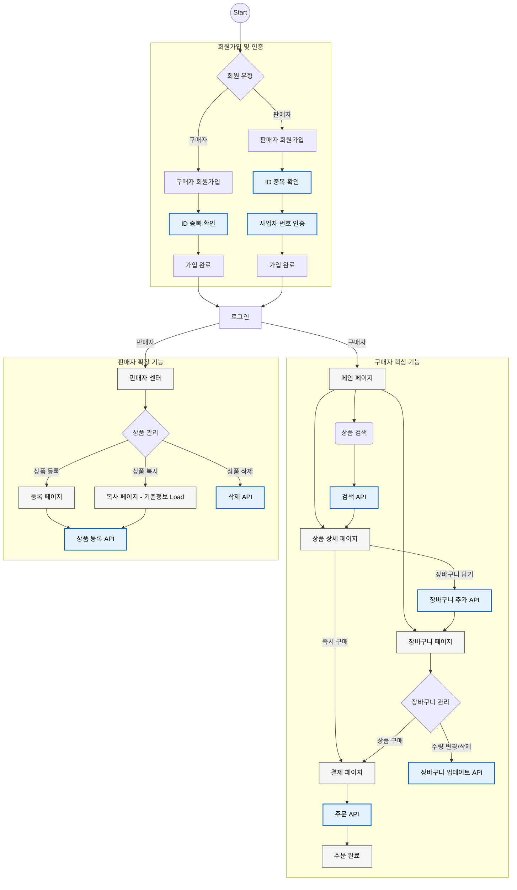
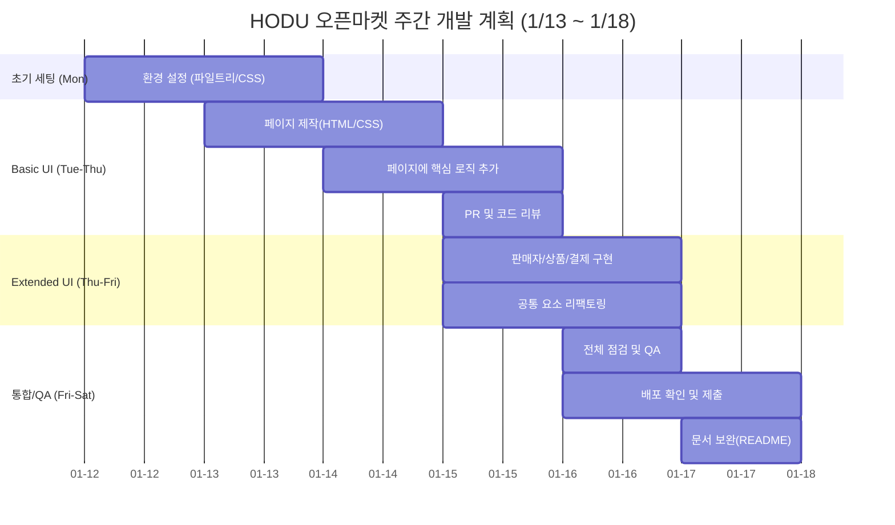

# HODU Open Market (호두 오픈마켓)

> **ModuLab FE6 Team 5 - Open Market Project**
>
> 바닐라 자바스크립트(Vanilla JS)와 Vite를 활용하여 구축한 **오픈마켓 플랫폼 HODU**입니다.
> 판매자는 상품을 등록하여 판매할 수 있고, 구매자는 상품을 검색하고 장바구니에 담아 결제하는 E-Commerce의 핵심 기능을 완벽하게 구현했습니다.


## 1. 프로젝트 개요

- **프로젝트명**: HODU (호두 오픈마켓)
- **개발 기간**: 2026.01 ~ (진행 중)
- **개발 인원**: Front-End 3명 (Team Project)
- **배포 주소**: https://modulab-fe6-team5.github.io/openMarket/
- **Test Account**
  ```text
  [구매자]
  ID : buyer1
  PW : weniv1

  [판매자]
  ID : seller1
  PW : weniv1
  ```

- **로컬환경 실행법**

- **Repository 클론**
```bash
$ git clone https://github.com/modulab-fe6-team5/openMarket.git

# 패키지 설치
$ npm install

# 개발 서버 실행
$ npm run dev
```



---

## 3. 기술 스택 (Tech Stack)

| 구분 | 기술 | 설명 |
| :--- | :--- | :--- |
| **Core** |    | 웹 표준 및 ES6+ 문법 활용 |
| **Build** |  | 빠른 개발 서버 및 번들링 최적화 |
| **Deploy** |  | 정적 웹 호스팅 |
| **API** |  | RESTful API 비동기 통신 |
| **Collaboration** |   | 형상 관리 및 협업 |

---

## 4. 페이지 구조 (Page Structure)

이 프로젝트는 **Vite**를 기반으로 한 **MPA(Multi Page Application)** 구조로 설계되었습니다. 
각 페이지는 독립된 `html` 진입점을 가지며, 디렉토리 기반의 경로로 이동합니다.

| 페이지 | 파일 경로 (URL Path) | 설명 | 접근 권한 |
| :--- | :--- | :--- | :--- |
| **메인** | `/` | 상품 목록 및 배너 | All |
| **로그인** | `/src/pages/login/` | 구매자/판매자 로그인 | Guest |
| **회원가입** | `/src/pages/signup/` | 회원가입 폼 | Guest |
| **상품 상세** | `/src/pages/product-detail/` | 상품 상세 정보 및 장바구니 담기 | All |
| **장바구니** | `/src/pages/cart/` | 장바구니 목록 및 수정 | Buyer |
| **주문/결제** | `/src/pages/payment/` | 주문서 작성 및 결제 | Buyer |
| **판매자 센터** | `/src/pages/seller-center/` | 판매 상품 대시보드 | Seller |
| **상품 등록** | `/src/pages/seller-center/product-upload/` | 상품 등록 및 수정 | Seller |

---

## 5. 주요 기능 (Key Features)

### 5-1. 회원가입 및 로그인 (Authentication)
<details>
<summary><strong>상세 구현 로직 보기 (Click)</strong></summary>
<br>

- **탭(Tab) 기반 UI**: 구매자와 판매자 회원을 탭으로 구분하여, 로그인 타입을 명확히 선택하고 전환할 수 있습니다. 판매자 탭 선택 시 사업자 전용 필드(등록번호, 스토어명)가 동적으로 노출됩니다. 
- **로그인 유효성 검사 및 UX**: 
  - **에러 핸들링**: 로그인 실패 시(비밀번호 불일치 등) 비밀번호 입력란을 **초기화하고 다시 포커스**를 주어 재입력을 유도합니다.
- **회원가입 검증 프로세스**: 
  - **순차 입력 유도**: 사용자가 순서를 건너뛰어 입력하려 할 경우, 이전 필수 항목(아이디, 비밀번호 등)의 입력을 감지하여 경고를 띄우고 해당 위치로 포커스를 되돌립니다.
  - **API 기반 데이터 검증**: 
    - **아이디 중복 확인**: API 통신을 통해 중복확인 클릭시 아이디 중복 여부를 확인하고 사용 가능 여부를 피드백합니다.
    - **사업자 인증**: 판매자 가입 시 사업자 등록번호 API 검증을 통해 유효하지 않은 사업자 번호의 입력을 원천 차단합니다.
  - **제출 및 에러 처리**:
  - **동적 버튼 제어**: 아이디/비밀번호 정규식 검사, 약관 동의 등 모든 필수 조건(`State`)이 충족될 때만 가입 버튼이 활성화(`Active`)됩니다.
  - **서버 에러 매핑**: 회원가입 요청 실패 시, 서버에서 반환된 에러 필드(예: `user_name`, `phone_number`)를 분석하여 해당 입력창 하단에 정확한 에러 메시지를 노출합니다.
  - **가입 성공 피드백**: 회원가입 성공 시 **안내 모달**을 띄워 사용자에게 명확한 피드백을 제공한 후 로그인 페이지로 이동합니다.

</details>

### 5-2. 헤더 및 네비게이션 (Global Navigation Bar)
<details>
<summary><strong>유저 타입별 UI & 검색 로직 상세 (Click)</strong></summary>
<br>

**유저 타입별 맞춤 UI**
`localStorage`의 토큰 및 유저 타입(`userType`)에 따라 네비게이션 메뉴를 다르게 렌더링합니다.

* **비회원**
  * **장바구니**: 클릭 시 로그인 모달(`showLoginModal`)이 호출됩니다.
  * **로그인**: 로그인 페이지로 이동하는 버튼이 노출됩니다.

* **회원 (구매자)**
  * **장바구니**: 클릭 시 장바구니 페이지로 이동하며, 현재 페이지가 장바구니일 경우 아이콘이 활성화(Active State) 됩니다.
  * **마이페이지**: 드롭다운 메뉴를 포함한 버튼이 노출됩니다.

* **판매자 (SELLER)**
  * **판매자 센터**: 장바구니 대신 판매자 센터 페이지로 이동하는 버튼이 노출됩니다.
  * **마이페이지**: 구매자와 동일하게 드롭다운 메뉴가 노출됩니다.

**검색 기능 (Search Implementation)**
사용자 경험 최적화를 위해 실시간 검색 제안 및 디바운싱 기술을 적용했습니다.

* **실시간 검색 제안 (Auto-complete)**
  * 검색어 입력 시 `searchProducts` API를 호출하여 최대 **10개**의 추천 상품 리스트를 드롭다운으로 보여줍니다.
  * 추천 상품 클릭 시 해당 상품의 상세 페이지(`product-detail`)로 즉시 이동합니다.

* **성능 최적화 (Debouncing)**
  * 잦은 API 호출을 방지하기 위해 **300ms**의 디바운스(Debounce) 타이머를 적용했습니다.
  * 마지막 요청 키워드 추적(`lastFetchedKeyword`)을 통해 중복 호출 및 불필요한 네트워크 트래픽을 차단합니다.

* **검색 실행**
  * 엔터 키 입력 또는 검색 버튼 클릭 시, 검색어가 포함된 상품 목록 페이지(`index.html?search=...`)로 이동합니다.

* **UX 디테일**
  * 입력창 포커스 아웃(Blur) 시 추천 목록이 닫히지만, 목록 클릭 시에는 이벤트가 유지되도록(`mousedown` 처리) 하여 사용성을 높였습니다.

**인터랙션 및 상태 관리**

* **마이페이지 드롭다운**: 아이콘 클릭 시 토글(Toggle) 방식으로 메뉴가 활성화되며, 외부 영역 클릭 시 자동으로 닫힙니다.
* **로그아웃**: 클릭 시 로컬 스토리지 정보를 삭제하고 로그아웃 모달을 띄운 뒤 메인으로 리다이렉트합니다.
* **로고**: 클릭 시 메인 페이지로 이동합니다.

</details>

### 5-3. 메인 및 상품 목록 (Home & Product List)
<details>
<summary><strong>배너 및 상품 카드 상세 (Click)</strong></summary>
<br>

- **인터랙티브 배너**: 슬라이드 형태의 배너를 구현하여 자동 롤링 및 좌우 버튼 컨트롤 기능을 제공합니다.
- **상품 카드**: 상품 이미지, 판매자명, 가격, 상품 이름을 직관적으로 배치하였으며 클릭 시 상세 페이지로 이동합니다.

</details>

### 5-4. 상품 상세 (Product Detail)
<details>
<summary><strong>렌더링, 장바구니 로직, 권한 제어 상세 (Click)</strong></summary>
<br>

**동적 상태 관리 및 렌더링**
* **상품 정보 렌더링**: API를 통해 받아온 이미지, 가격, 배송 정보(택배/직접배송, 무료/유료)를 렌더링합니다.
* **품절 처리 (Sold Out)**: 재고(`stock`)가 0인 경우, 모든 구매 관련 버튼을 비활성화하고 '품절' 상태를 표시합니다.
* **실시간 수량 및 가격 계산**
  * `+` / `-` 버튼으로 수량을 조절하며, **최소 1개 ~ 최대 재고량** 사이에서만 동작하도록 제한합니다.
  * 수량 변경 시 총 주문 금액이 실시간으로 재계산되어 표시됩니다.

**고도화된 장바구니 로직 (Smart Cart Logic)**
상품을 장바구니에 담을 때 중복 여부를 체크하여 사용자 경험을 최적화했습니다.

* **중복 상품 감지**: `getCart` API를 먼저 호출하여 현재 보고 있는 상품이 이미 장바구니에 있는지 확인합니다.
  * **중복 시**: "이미 장바구니에 있는 상품입니다"라는 **모달(Modal)**을 띄워 장바구니 이동 여부를 묻습니다.
  * **신규 추가 시**: `addToCart` API 호출 후, 시스템 Confirm 창을 통해 장바구니 이동 여부를 확인합니다.

**유저 타입별 권한 제어 (Access Control)**
로그인 여부 및 유저 타입(`userType`)에 따라 UI 상호작용을 제한합니다.

* **비회원**: 구매 또는 장바구니 버튼 클릭 시 **로그인 유도 모달**(`showLoginModal`)이 호출됩니다.
* **판매자 (SELLER)**
  * 본인의 상품 구매를 방지하기 위해 구매하기, 장바구니, 수량 조절 버튼이 모두 **비활성화(Disabled)** 됩니다.
  * 버튼 스타일이 변경(Cursor Not Allowed, 회색 처리)되어 시각적으로 클릭 불가능함을 안내합니다.

**주문 연동**

* **바로 구매**: 로그인 체크 후, 주문 정보(`order_kind`, `product_id`, `quantity`)를 `localStorage`에 저장하고 결제 페이지로 즉시 이동합니다.

</details>

### 5-5. 장바구니 및 결제 (Cart & Payment)
<details>
<summary><strong>실시간 계산, 주문 연동 및 결제 로직 상세 (Click)</strong></summary>
<br>

**장바구니 (Cart)**
- **실시간 재고 확인 및 품절 처리**: 장바구니 진입 시 각 상품의 최신 재고(`stock`) 정보를 조회하여, 품절된 상품은 자동으로 비활성화(Dimmed) 처리하고 주문 선택을 방지합니다.
- **동적 상태 관리**:
  - **수량 조절**: 상품 수량 변경 시 API(`PUT /cart/:id`)를 즉시 호출하여 서버 데이터와 동기화하며, 변경된 수량에 맞춰 합계를 재계산합니다.
  - **선택 기능**: '전체 선택' 및 '개별 선택' 체크박스를 제공하며, 품절된 상품은 전체 선택에서 자동으로 제외됩니다.
- **실시간 합계 계산**: 사용자가 선택한 상품(체크된 항목)에 대해서만 상품 금액과 배송비를 실시간으로 합산하여 최종 결제 예정 금액을 표시합니다.
- **주문 연동**: '바로 주문하기'와 '선택 상품 주문하기'를 구분하여 처리하며, 결제에 필요한 데이터를 `localStorage`에 저장 후 결제 페이지로 이동합니다.

**주문 및 결제 (Payment)**
- **주문 유형별 데이터 로딩**: `localStorage`에 저장된 주문 데이터(`order_data`)를 기반으로 **바로 구매(Direct Order)**와 **장바구니 구매(Cart Order)**를 구분하여 상품 리스트를 렌더링합니다.
- **배송지 주소 검색**: **Daum 우편번호 API**를 연동하여 사용자가 우편번호와 주소를 간편하고 정확하게 입력할 수 있도록 지원합니다.
- **입력 폼 유효성 검사 (Validation)**:
  - 주문자 정보(이름, 연락처, 이메일)와 배송지 정보, 정보 제공 동의 여부를 실시간으로 감지합니다.
  - 모든 필수 항목이 올바르게 입력된 경우에만 '결제하기' 버튼이 활성화되어 오입력을 방지합니다.
- **최종 결제 처리**:
  - 신용카드, 무통장입금, 간편결제(네이버페이, 카카오페이) 등 결제 수단 선택 UI를 제공합니다.
  - 최종 주문 요청 시 주문 유형(`order_kind`)과 상품 정보, 배송 정보를 포함하여 서버(`POST /order/`)로 전송하며, 성공 시 메인 페이지로 이동합니다.

</details>

### 5-6. 판매자 센터 (Seller Center)
<details>
<summary><strong>대시보드 및 상품 관리(복사/수정) 로직 상세 (Click)</strong></summary>
<br>

**판매자 대시보드 (Dashboard)**
- **상품 현황 모니터링**: 판매자가 등록한 상품의 총 개수를 배지로 시각화하여 보여주며, 상품 리스트를 통해 재고(`stock`)와 가격 정보를 한눈에 파악할 수 있습니다.
- **삭제 프로세스**: 상품 삭제 시 `Modal` 컴포넌트를 호출하여 실수를 방지하며, 삭제 확정 시 API(`DELETE`)를 호출하고 리스트를 갱신합니다.
- **개인화된 헤더**: `localStorage`에 저장된 판매자 정보를 활용하여 대시보드 상단에 상점명과 환영 문구를 동적으로 표시합니다.

**상품 관리 (Product Management)**
- **통합 관리 페이지**: 하나의 페이지(`upload.js`)에서 **신규 등록**, **기존 상품 수정**, **상품 복사** 기능을 모드(`mode`)에 따라 분기하여 효율적으로 처리합니다.
- **스마트한 상품 복사 (Duplicate)**:
  - 기존 상품의 정보를 불러와 입력 필드를 자동으로 채워줍니다.
  - **이미지 자동 변환**: 기존 상품의 이미지 URL을 `fetch`하여 `Blob` 객체로 변환함으로써, 사용자가 이미지를 다시 업로드하지 않아도 복제 등록이 가능하도록 구현했습니다. (로컬 환경을 위한 Proxy 처리 포함)
- **직관적인 UX**:
  - **이미지 미리보기**: `FileReader`를 사용하여 이미지를 업로드하기 전에 미리 볼 수 있습니다.
  - **배송 설정**: 택배(Parcel)와 직접 배송(Delivery)을 버튼 토글 방식으로 간편하게 선택할 수 있습니다.
- **유효성 검사**: 상품명, 가격, 재고, 상세 정보 및 이미지 등록 여부를 검사하여 불완전한 데이터 전송을 방지합니다.

</details>
---

## 6. 폴더 구조 (Directory Structure)

```text
openmarket
├── public/              # 정적 리소스
├── src/
│   ├── assets/          # 이미지, 폰트 등 에셋
│   ├── components/      # 재사용 가능한 컴포넌트 (Header, Footer, Modal 등)
│   ├── pages/           # 페이지별 로직 및 스타일
│   │   ├── cart/        # 장바구니
│   │   ├── login/       # 로그인
│   │   ├── payment/     # 결제
│   │   ├── product-detail/ # 상품 상세
│   │   ├── seller-center/  # 판매자 센터 (대시보드, 상품 업로드)
│   │   └── signup/      # 회원가입
│   ├── styles/          # 공통 스타일 (reset, common)
│   └── utils/           # 유틸리티 함수 (API 호출 등)
├── index.html           # 메인 페이지 진입점
├── main.js              # 메인 스크립트
├── main.css             # 메인 스타일
├── vite.config.js       # Vite 설정 파일
└── package.json         # 프로젝트 의존성 관리
```
---

## 7. 개발 주안점 및 트러블 슈팅

### 7-1. API 모듈화 및 유연한 에러 핸들링
- **문제**: `fetch`를 래핑한 `request` 유틸리티 함수를 구현하여 사용했더니 백엔드 API마다 에러 응답 구조가 조금씩 상이하여(예: 회원가입 등), 단일화된 에러 처리가 어려운 문제가 있었습니다.
- **해결**:
    - `request` 함수 내부에서 에러를 일괄 처리하는 대신, 에러 객체 전체를 반환하도록 설계하여 호출하는 각 컴포넌트(함수) 상황에 맞춰 유연하게 예외 처리를 할 수 있도록 구조를 개선했습니다.

### 7-2. 판매자 센터 상품 복사 기능 및 CORS 이슈
- **기능 구현**: 상품 등록 시 매번 동일한 정보를 입력해야 하는 번거로움을 해소하기 위해, URL 파라미터(`?mode=copy`)를 활용한 **상품 복사 기능**을 구현했습니다. 기존 상품 데이터를 폼에 자동 입력하고, 이미지 URL을 `fetch`하여 `Blob` 객체로 변환해 재전송하는 방식을 사용했습니다.
- **트러블 슈팅 (CORS 이슈)**:
    - **현상**: 로컬 환경에서는 정상 작동하던 이미지 복사 기능이 GitHub Pages 배포 환경에서는 작동하지 않는 문제가 발생했습니다.
    - **원인**: 백엔드 서버에서 배포 도메인에 대한 CORS(Cross-Origin Resource Sharing) 허용 정책이 엄격하게 설정되어 있어, 클라이언트(JS)에서 이미지 데이터를 직접 조작(`fetch`)하는 것이 차단되었습니다.
    - **대처**: 배포 환경에서의 보안 제약 사항을 확인하고, 현재 환경(프론트엔드 단독 배포)에서의 한계점을 명확히 인지하였습니다. (추후 Proxy 서버 구축 등을 통한 해결 방안 모색)

### 7-3. Vite 환경 변수를 활용한 배포 경로 최적화
- **문제**: 로컬 개발 환경과 달리, GitHub Pages 배포 시 하위 디렉토리(`/openMarket/`) 경로로 인해 이미지나 페이지 이동 시 절대 경로가 깨지는 문제가 발생했습니다.
- **해결**: Vite의 `import.meta.env.BASE_URL` 객체를 활용하여 동적으로 경로를 할당했습니다. `vite.config.js`에서 `base` 경로를 설정하고, 코드 내 모든 절대 경로 참조 부분에 이를 적용하여 배포 환경에서도 리소스가 올바르게 로드되도록 수정했습니다.

### 7-4. 컴포넌트 기반 설계 및 리팩토링
- **설계**: 바닐라 자바스크립트를 사용하지만 `Header`, `Footer`, `Modal` 등을 컴포넌트로 추상화하여 재사용성을 높였습니다.
- **리팩토링**: 초기 개발 시 기능별로 파편화되어 생성되던 모달(삭제 모달, 로그인 모달 등)을 공통 createCommonModal 함수를 사용해 생성하도록 리팩토링하여 유지보수 효율을 높이고 코드 중복을 최소화했습니다.

### 7-5. 보안 및 데이터 저장소에 대한 고찰
- **현황**: 현재 프로젝트는 `localStorage`를 사용하여 인증 토큰 등을 관리하고 있습니다.
- **회고 (Lesson Learned)**: `localStorage`는 XSS 공격 등에 취약할 수 있음을 인지하였습니다. 향후 개선 시에는 보안 강화를 위해 `sessionStorage`와 `HttpOnly Cookie`를 조합하여 사용하는 방식이 최신 웹 개발 트렌드이자 보안적으로 더 안전한 방법임을 학습하였으며, 차기 프로젝트에 이를 반영할 계획입니다.

---

## 7. 팀원 정보

- **이름**: 백동명 (팀장)
- **역할**: Front-End Developer(공통요소 제작, 메인페이지 제작)
- **GitHub**: https://github.com/backdongmyeong
- **Email**: backdongmyeong@gmail.com

- **이름**: 박외숙 (팀원)
- **역할**: Front-End Developer(모달창, 상세정보페이지 제작)
- **GitHub**: https://github.com/pahkys-prog
- **Email**: pahkys@gmail.com

- **이름**: 이원희 (팀원)
- **역할**: Front-End Developer(판매잔센터페이지, 구매페이지 제작)
- **GitHub**: https://github.com/212jeju
- **Email**: [EMAIL_ADDRESS]

---

Copyright © 2026 ModuLab FE6 Team 5. All rights reserved.